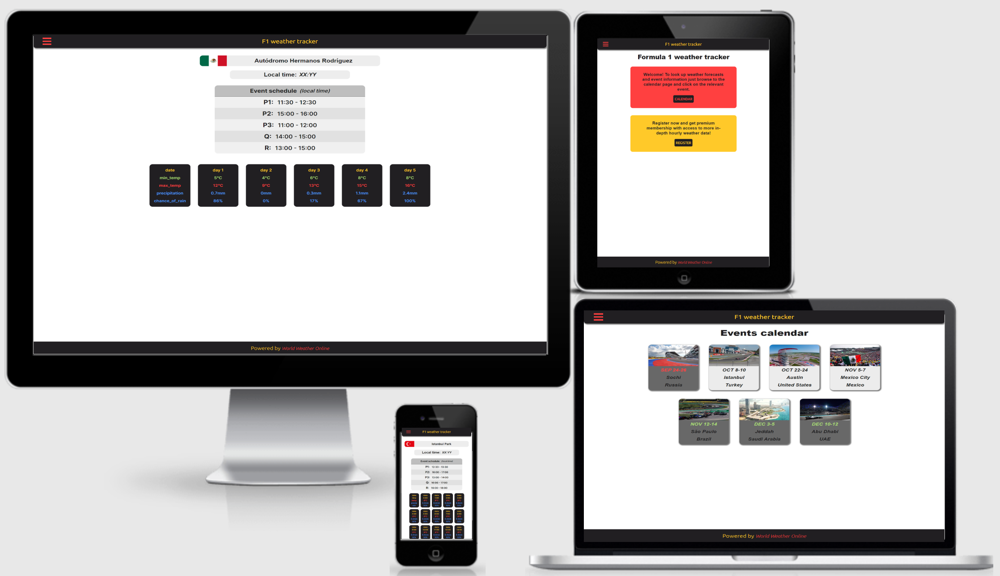
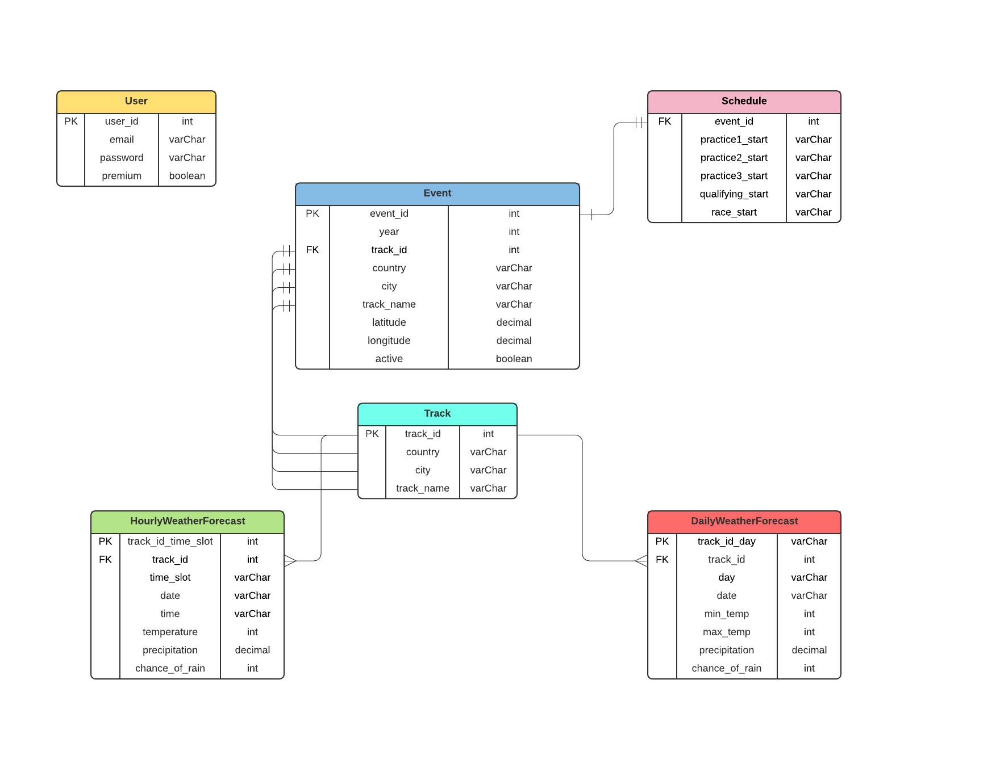

# F1 weather tracker v2

View live version of the website [here](https://f1-weather-v2.herokuapp.com/).

Milestone Project 4: Full Stack Frameworks with Django – [Code Institute](https://codeinstitute.net/)

This website was made as my fourth and final milestone project for the Code Institute course. The website was created for Formula 1 fans like myself, to provide them with accurate weather data of event locations. The project requirements were to create a full-stack website with a relational database using HTML, CSS, JavaScript, Python and Django. Additional requirements were to set up authentication, and provide paid access to the site's data and/or other activities using Stripe payments.

---

## Contents

- [**User Experience Design (UXD)**](#user-experience-design-uxd)

  - [Strategy](#strategy)
    - Goal
    - User stories
  - [Scope](#scope)
    - Functional specifications
    - Content requirements
  - [Structure](#structure)
    - Information architecture
    - Interaction design
  - [Skeleton](#skeleton)
    - Wireframes
  - [Surface](#surface)
    - Colours
    - Typography
    - Uniformity

- [**Features**](#features)

  - Existing features
  - Future features

- [**Database schema**](#database-schema)

- [**Technologies**](#technologies)

  - Languages
  - Frameworks
  - Libraries
  - Software

- [**Testing**](#testing)

- [**Deployment**](#deployment)

  - Set up database
  - Hosting online
  - Running locally

- [**Credits**](#credits)

  - Code
  - Text
  - Media
  - Miscellaneous
  - Acknowledgements

- [**Notes**](#notes)

---

## User experience design (UXD)

### Strategy

#### Goal

The goal for the website is to provide Formula 1 fans with accurate weather data of event locations.

#### User stories

- As a **visitor**, I would like **to see the Formula 1 calendar**, so that **I know which events are happening soon**.

- As a **premium member**, I would like **to access hourly weather data**, so that **I can better estimate under what weather conditions the race will be held**.

- As a **site owner**, I would like **to have an authentication system**, so that **I can give customers premium membership status**.

### Scope

#### Functional specifications

The website should have navigation to switch between all the pages. Content on the website should support different screen sizes. Wherever appropriate and or possible, visible indicators should be shown to users when they can perform an action on the website (like clicking a link or a button).

#### Content requirements

The website should display the Formula 1 calendar, daily weather forecast data, and hourly weather forecast data. There should be pages for registering and logging in. There should be a page where customers can purchase premium membership.

### Structure

#### Information architecture

Every page has a hamburger menu icon with navigation links. The homepage advertises the purpose of the website and provides additional navigation to the register page. The Formula 1 calendar page has navigation to each (active) event. The individual event pages have navigation to the hourly and daily weather data pages.

#### Interaction design

Depending on their device, users could see through visible indicators like changes of colour and/or changing mouse pointers whether something is clickable. Icons such as an arrow pointing down indicate to users that an element can be expanded. Users with touchscreens can swipe up and down to scroll through the page, and they can (double)tap to select buttons and navigation elements. No audio will be used in this website.

### Skeleton

For all screen sizes the skeleton should be quite the same. The header will have a hamburger menu icon on the left, and a logo or some text in the center. The footer will probably reference the weather API. The homepage displays an image with some advertisement and navigation to the register page. The Formula 1 calendar page has a card for each event. Each individual event page has two cards, one for the daily weather forecast and one for the hourly weather forecast. The daily weather forecast page has a country flag and track name at the top, underneath that the local time of the event location is displayed, underneath that the event schedule is displayed, underneath that there are seven cards that display weather data for the next seven days. The hourly weather forecast page is the same as the daily weather forecast page, except that there are twenty-four cards with weather data instead of seven, one for each hour of the current day.

#### Wireframes

To see all the wireframes in a single PDF [click here](docs/wireframes/f1weather_wireframes.pdf).

To see separate PNG image files of the wireframes check the docs/wireframes folder.

### Surface

#### Colours

The main colours will be dark gray and yellow again, just as with my milestone two project. I will use the blue colour for weather data such as precipitation and rain. The red colour will most likely be used for temperature data. Instead of making the entire website dark gray again by using it for the background, I will use a regular white colour for a cleaner look and better visible separation between elements. The green colour will be used for minimum temperature in the daily weather forecast data.

#### Typography

In total, I've used three different font families from the Google Fonts library. The font Ubuntu was used for regular things like the header and footer, and additionally for most buttons as well. The font Titillium+Web is similar to the one used on the official Formula 1 website and was used for most of the main content on the website. The font Inter was used for displaying the weather data.

#### Uniformity

To keep the website looking uniform I will do my best to make sure that all related content throughout the website is consistent in font-size and styling. The positioning of elements and content should be consistent in height, padding, and spacing. I'm also using either grid, flexbox or both to present the content in a logical order, either through custom CSS or through external styling frameworks.

**_[Back to top](#contents)_**

---

## Features

### Existing features

#### General features

**Header**:

- Will always be visible at the top of every page.
- Has clickable text/logo in the center that returns the user to the homepage.
- On the left side it has a hamburger menu icon clicking it opens the side navigation menu.

**Side navigation menu**:

- Will be visible at the left of every page after clicking the hamburger menu icon.
- Depending on whether or not a user is logged in it has internal links to the home page, calendar, profile, premium, login, or logout pages.

**Footer**:

- Will always be visible at the bottom of every page.
- Has an external link to the weather API provider.

#### Page specific features

**Homepage**:

- Has a div with a welcome message and a button with an internal link to the calendar page.
- Has a div telling the visitor to register and mentions buying premium membership to access additional weather data. This div also has a button with an internal link to the register page.

**Calendar page**:

- Has cards for each of the (remaining) Formula 1 calendar events. Each card shows the event date and location. Clicking on active cards takes you to the single event page.

**Single event page**:

- Has a wide div that displays the country flag for the selected event and the track name.
- Has two cards. One card has an internal link to the hourly forecast page, and the other card has an internal link to the daily forecast page.

**Hourly forecast page**:

- The data on this page is only accessible for users with a premium membership.
- Has a wide div that displays the country flag for the selected event and the track name.
- Has a wide div that displays the local time of the event location.
- Has a div with the event schedule which included all the local starting times for each session.
- Has twenty-four cards with weather data for the selected event, one card for each hour of the day.

**Daily forecast page**:

- Has a wide div that displays the country flag for the selected event and the track name.
- Has a wide div that displays the local time of the event location.
- Has a div with the event schedule which included all the local starting times for each session.
- Has five cards with weather data for the selected event, one card for each of the next five days.

**Premium page**:

- This page is only accessible for users who don't have a premium membership yet.
- Shows the logged in user their email address.
- Has an element for executing a Stripe payment to purchase premium membership.

**Profile page**:

- This page is only accessible for logged in users.
- Shows the logged in user their email address.
- Shows the logged in user their premium membership status.

### Future features

- Adding more functionality to the user profile page, such as email and password change.

- Add a function to display the actual local time of a selected event.

- Add actual API weather data to the database each hour for each calendar event. This whole project has been an absolute nightmare, I didn't even have time to try to implement this. But in hindsight it would've been a waste of time anyway, since I'll take this project offline as soon as I get my grade. If I ever decide to actually build this it will be with NodeJS.

**_[Back to top](#contents)_**

---

## Database schema

For this project we were required to create a relational database. In total I set up 5 entities, which you can see in the image below. Primary keys are indicated with PK, and foreign keys with FK.

**_[Back to top](#contents)_**

---

## Technologies

### Languages

- [HTML5](https://developer.mozilla.org/en-US/docs/Web/Guide/HTML/HTML5) - for the structuring of the website.

- [CSS3](https://developer.mozilla.org/en-US/docs/Archive/CSS3) - for the styling and responsiveness of the website.

- [SASS](https://sass-lang.com/) - a scripting language that extends CSS.

- [JavaScript](https://developer.mozilla.org/en-US/docs/Web/JavaScript) - for the (interactive) functionality of the website.

- [Python](https://www.python.org/) - for the backend functionality of the website.

### Frameworks

- [Django](https://www.djangoproject.com/)

### Libraries

- [Google Fonts](https://fonts.google.com/) - for the Ubuntu, Titillium+Web, and Inter font-families.

### Databases

- [PostgreSQL](https://www.postgresql.org/)

### Software

- [Balsamiq](https://balsamiq.com/) - for creating the wireframes.

- [Visual Studio Code (desktop version)](https://code.visualstudio.com/) - for coding and creating the project.

- [Git (BASH)](https://gitforwindows.org/) - for version control in the VSCode terminal.

- [Google Chrome](https://www.google.com/chrome/) - for testing the website with their devtools.

- [pgAdmin4](https://www.pgadmin.org/download/pgadmin-4-windows/) - for managing the PostgreSQL database.

**_[Back to top](#contents)_**

---

## Testing

A separate file with testing information can be found [here](docs/testing/TESTING.md).

**_[Back to top](#contents)_**

---

## Deployment

### Set up database

placeholder

### Hosting online

placeholder

### Running locally

placeholder

**_[Back to top](#contents)_**

---

## Credits

All numbered references below correspond with a comment in either the HTML, CSS, SCSS, JavaScript or Python code.

### Code

#1: Used [this tutorial](https://learndjango.com/tutorials/django-log-in-email-not-username) to create a log in model without username.

#2: Referenced [this video](https://www.youtube.com/watch?v=t6RbanOhna4) to set up my connection to PostgreSQL.

#3: Referenced [this tutorial](https://learndjango.com/tutorials/django-log-in-email-not-username) to create the error handling views.

#4: Referenced [this video](https://www.youtube.com/watch?v=OFKBep95lb4) to create a slide-out sidenav with a hamburger menu icon.

#5: Referenced [this video](https://www.youtube.com/watch?v=oZwyA9lUwRk) to build the stripe payments functionality.

#6: Used [this tutorial](https://simpleit.rocks/python/django/django-favicon-adding/) to set up the favicon.

### Text

None.

### Media

#7: Country flag images taken from the [official Formula 1 website](https://www.formula1.com/).

#8: Used [this photo](https://tilke.de/en/portfolio/sochi-autodrom/) of Sochi Autodrom.

#9: Used [this photo](https://mapio.net/images-p/12655594.jpg) of Istanbul Park.

#10: Used [this photo](https://www.racesport.nl/wp-content/uploads/2020/03/COTA-e1583853061975.jpg) of Circuit of The Americas.

#11: Used [this photo](https://i.redd.it/5ef9fm5pwdt31.jpg) of Autódromo Hermanos Rodríguez.

#12: Used [this photo](https://www.formula1.com/content/dam/fom-website/sutton/2017/Brazil/Sunday/dcc1712no236.jpg) of Autódromo José Carlos Pace.

#13: Used [this image](https://tilke.de/wp-content/uploads/2021/03/21-03-10_Aerial_Cam02-FX.jpg) of Jeddah Street Circuit.

#14: Used [this photo](https://img.bleacherreport.net/img/images/photos/003/840/531/hi-res-118e0b6c0d6637f1cc0ddb6cbb2781c5_crop_north.jpg?1575211406&w=3072&h=2048) of Yas Marina Circuit.

### Miscellaneous

- Used https://coolors.co/ to create an image of my colour palette (see ['Surface'](#surface) section of the README).

- Referenced [this tutorial](https://stackpython.medium.com/how-to-start-django-project-with-a-database-postgresql-aaa1d74659d8) to install and setup pgAdmin4 and PostgreSQL 9.6 which caused me a lot of trouble with deployment. Wish I knew beforehand what version of PostgreSQL to use, would have saved me a lot of time.

- Used https://lucid.app/ to create an ER diagram image of my database schema.

### Acknowledgements

- Thanks to my mentor, Simen Daehlin, for his quick responses on Slack and for giving me some hints whenever I ran into issues.

**_[Back to top](#contents)_**

---

## Notes

placeholder

**_[Back to top](#contents)_**

---
